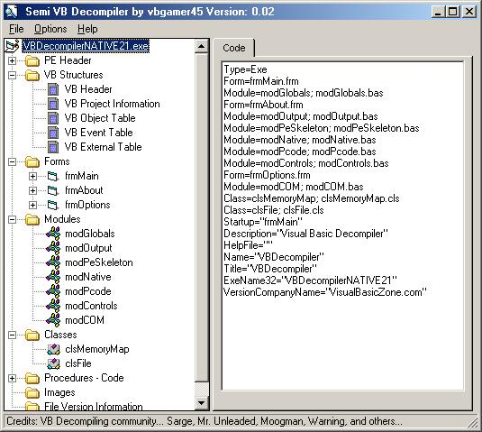



## Semi VB Decompiler

### Description

A Semi VB Decomiler. Decompiles the interface using COM. COM is not always correct in the datatypes it returns for a certain property. I started this project a week ago after seeing there were no good open source vb interface decompilers and the other examples on this site are not very good. Another reason is there are some companies that charge for just decompiling the interface which I do not think is very fair. This is not complete but use it as a guide to making your own interface decompiler and maybe make something more. Hope you can learn something from this.
 
### More Info
 

             |
---                |---
**Submitted On**   |2004-07-23 10:48:08
**By**             |[vbgamer45](https://github.com/Planet-Source-Code/PSCIndex/blob/master/ByAuthor/vbgamer45.md)
**Level**          |Intermediate
**User Rating**    |4.9 (64 globes from 13 users)
**Compatibility**  |VB 5\.0, VB 6\.0
**Category**       |[Miscellaneous](https://github.com/Planet-Source-Code/PSCIndex/blob/master/ByCategory/miscellaneous__1-1.md)
**World**          |[Visual Basic](https://github.com/Planet-Source-Code/PSCIndex/blob/master/ByWorld/visual-basic.md)
**Archive File**   |[Semi\_VB\_De1773187232004\.zip](https://github.com/Planet-Source-Code/vbgamer45-semi-vb-decompiler__1-55134/archive/master.zip)

